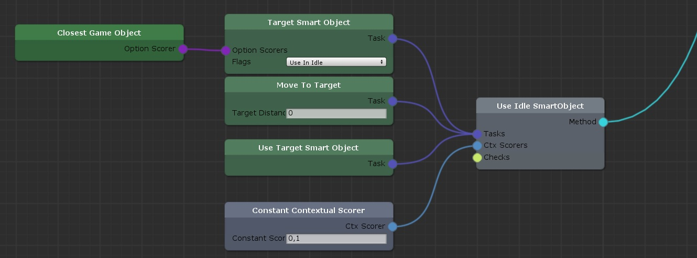
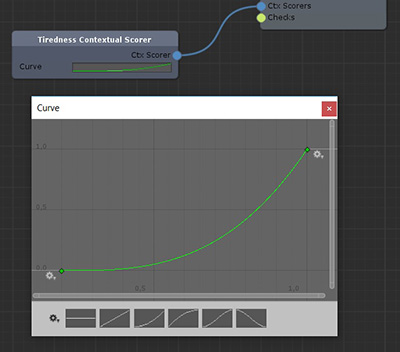
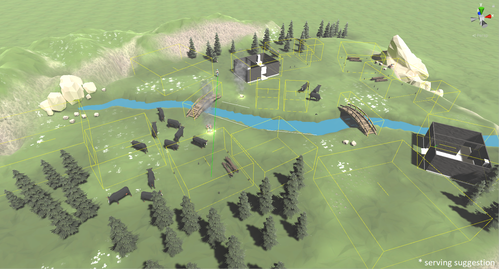
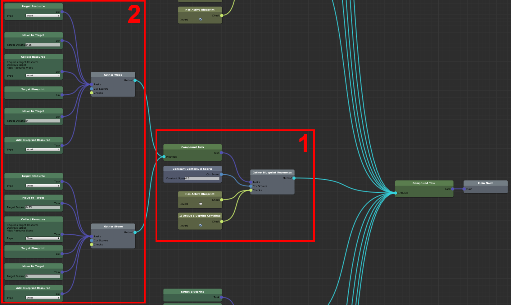

# SandboxAI
**Not even close to production ready. All feedback and patches are welcome.**

Minimal HTN AI implementation for [Unity3d](https://unity3d.com). It's perfect for a Skyrim-like sandbox AI. It doesn't follow any existing implementation. Instead it's
my own interpretation of the concept. 





Features:
- HTN/utility AI hybrid: priorize tasks and select inputs by utility functions
- One included dependency: [xNode](https://github.com/Siccity/xNode)
- Minimal api surface to learn while still having the possibility of creating a powerful game AI

Missing:
- Debugger
- Interruptions like getting attacked
- Partial plans: stop planning when the estimated execution time of the plan reaches some threshold
- No performance optimizations yet; The algorithm itself can be very fast and efficient

## Getting started
Use git to checkout the project or [unzip a release](https://github.com/SirPolly/SandboxAI/releases) into your Unit project Assets folder. Open the *Example/Example.scene*.

### Setup your GameObject
Derive from *SandboxAI.HTNAgent*. Create your state class deriving from *SandboxAI.IState*. 
Add an *IAgentNavigation* derived component (NavMeshAgentNavigation, SimplePositionAgentNavigation).

```CSharp
using SandboxAI.HTN;

[Serializable]
public class RobotState : IState {
	public Robot robot;

	public float hunger;
}

public class Robot : HTNAgent {
	RobotState _state = new RobotState();

	void Start() {
		_state.robot = this;
    }

	void Update() {
		UpdateAgent(_state);
	}
}
```

Look at the sample to learn how to create ContextualScorers, OptionScorers and Tasks. The *Robot_HTNGraph* contains the actual decision making.

Now, create your own logic classes and create your own HTNGraph by right-clicking in the project explorer, then clicking Create/SandboxAI/HTNGraph.

## The planner


Every time the current plan is completed or invalidated the planner is asked to create a new plan. The Main Nodes main input tells it where to start planning. It recursivly searches through Compound Task methods for a valid method. The final aim of the planner is to reduce the whole graph to a list of tasks.

**Methods** may have checks (yellow in the HTNGraph) for the AIs state (IState). The order in which they are checked depends on the contexual scorers (in blue). If one is found, it's tasks are validated with state checks too. Methods with checks and Compound Tasks allow you to disable a whole subpart of the graph (see 1).

**Tasks** are actual actions the AI is supposed to do. They are grouped by Methods into sequences of actions (see 2). Each Tasks may have preconditions and effects on the AIs state (IState). *Task.Check(IState state)* and *Task.Apply(IState state)* are used during planning and execution to express these. 


## Based upon
Introduction: https://www.youtube.com/watch?v=kXm467TFTcY

[Game AI Pro: Exploring HTN Planners through Example](http://www.gameaipro.com/GameAIPro/GameAIPro_Chapter12_Exploring_HTN_Planners_through_Example.pdf)

### Prerequisites
- Recent Unity version (2018)
- [xNode](https://github.com/Siccity/xNode)

## License
This project is licensed under the MIT License. You cannot sell this software on the Unity Asset Store or any other platform that sells software tools for developers. You may use this software in a commercial game.
